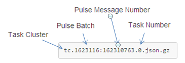

# S3 Bucket Convention

## About

The ActiveData ETL pipeline is responsible for extracting records from a variety of sources, transforming them, and loading them in S3 buckets. Each source is given a final destination bucket: 

 * active-data-firefox-files
 * active-data-fx-test-normalized
 * active-data-treeherder-normalized
 * active-data-test-result
 * active-data-perf
 * active-data-jobs
 * active-data-codecoverage
 * active-data-task-cluster-normalized",

## Accessing Buckets

These are all public buckets, which you can access using [Amazon's S3 Bucket API](https://docs.aws.amazon.com/AmazonS3/latest/API/RESTBucketGET.html).  Here is an example of a test result file around June 2018:

    curl https://s3-us-west-2.amazonaws.com/active-data-test-result?marker=tc.1623116

## Naming Convention

Each file in the S3 bucket is given a dot-delimited name. These names are called "keys", and they represent the ETL steps:

Here is more description of those steps 

 * Task Cluster - The data comes from listening on one of Task Clusters pulse queues
 * Pulse Message Number - Each pulse message is given a number for tracking
 * Pulse Batch - The pulse messages are batched in blocks of 100
 * Task Number - Each pulse message in the batch triggers a task cluster scan for metatdata

Inside each file is a CR-delimited list of JSON records representing the unit tests run during the task.

## Uniqueness

 Every record has an `_id` property with the containing file name as a prefix.

## Logical Identity

Most records processed by the ETL pipeline are events, and the `_id` is genuinely unique. This is not the case for all sources.

 * **treeherder** - The pipe extracting all Treeherder jobs uses the `job.id` property for uniquness. The treeherder pipe is catching snapshots throughout the day while the jobs evolve, and the new records must replace the old.
 * **bugzilla** - Bugzilla bugs use a `[bug_id, modified_ts]` pair for key; each represents a snapshot of the bug in time. These can change as the database is poked with new values and changing history, or added/deleted as bugs get marked public/private.   
